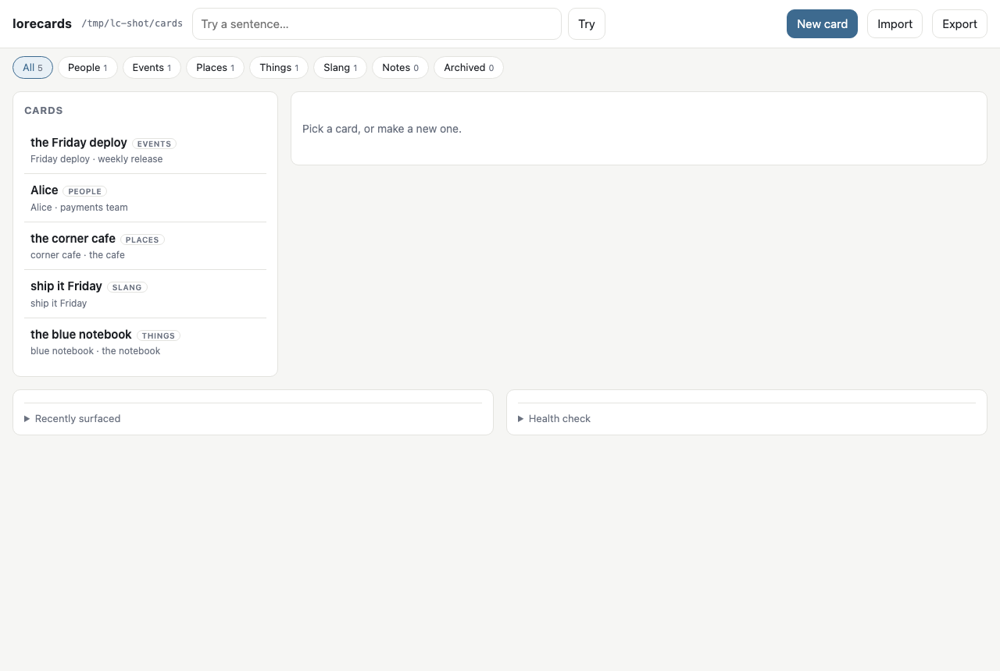
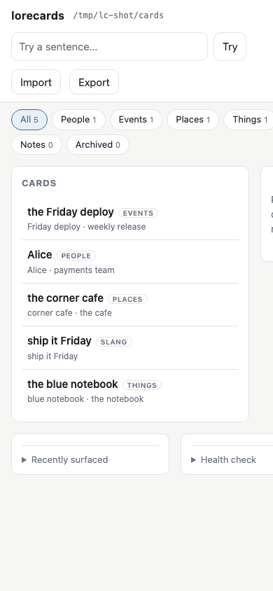

# lorecards

English · [中文](README.zh-CN.md)

A keyword-triggered **card book** for companion agents. One card per person, event, place,
thing or in-joke the user has mentioned — plain Markdown with YAML frontmatter, in a folder
they own. When the conversation mentions a card's keywords (anywhere in the last few turns,
not just the current message), the card is **written into the prompt before the model sees
it**. So the second time a friend or a running saga comes up, the AI already knows who is
who, and nobody has to write a "previously on…" recap.

Surfacing is not something the model has to remember to do. A proxy in front of your API, or
a hook in Claude Code, injects the card — the same way a world-info system does. And because
a card that fires every turn would be paid for every turn, each conversation keeps a small
ledger and the same card is not injected again for a few turns. See [Dedupe](#dedupe).

It is not RAG and not a memory store. Nothing is embedded, scored by similarity, or written
behind the user's back. A card book is **canon**: what the user (or the agent, through the
`write_card` tool) decided is worth remembering, in a file they can read, edit and delete.

```
~/cards/
  people/Alice.md
  events/the Friday deploy.md
  places/the corner cafe.md
  things/the blue notebook.md
  slang/ship it Friday.md
```

## Install

Not on PyPI yet — [install from source](#from-source) for now. Once it is published,
`pipx install lorecards-mcp` (or `uv tool install lorecards-mcp`) will be the short way.

```bash
lorecards init ~/cards            # the directories, plus one example card per kind
```

Then pick how cards reach your model. The three ways are independent.

### 1. The gateway (recommended)

A proxy that sits in front of your API and injects cards into the prompt. **Works with any
client that lets you set a base URL: SillyTavern, Kelivo, PWAs, SwiftUI apps, your own
scripts** — nothing has to know lorecards exists.

```bash
lorecards gateway --vault ~/cards --upstream https://api.openai.com
#   -> base URL for your client: http://127.0.0.1:8765/v1
```

Then in your client, change the API base URL from `https://api.openai.com/v1` to
`http://127.0.0.1:8765/v1` and leave everything else alone — your key still goes straight to
the upstream, unchanged and unlogged.

- **SillyTavern**: API Connections → Chat Completion → Custom (OpenAI-compatible) → Custom
  Endpoint `http://127.0.0.1:8765/v1`. Your API key stays in the same field it was in.
- **Kelivo** (and most mobile clients): Settings → Providers → the provider's *API base URL*
  → `http://127.0.0.1:8765/v1`. On a phone, use the computer's LAN address instead of
  `127.0.0.1` and start the gateway with `--host 0.0.0.0`.

Both protocols are handled, streaming included: `POST /v1/chat/completions`
(OpenAI-compatible) and `POST /v1/messages` (Anthropic Messages). Every other path is proxied
untouched.

```console
$ curl -s http://127.0.0.1:8765/v1/chat/completions -D- \
    -H 'Authorization: Bearer sk-…' -H 'Content-Type: application/json' \
    -d '{"model":"gpt-4o","messages":[{"role":"user","content":"how did the friday deploy go?"}]}'
x-lorecards-injected: the Friday deploy
…
# what the upstream received as the last user message
# (the marker's suffix is a per-process nonce, so it differs on every run):
# <!-- lorecards:9fef39 -->
# A memory surfaces:
#
# ### the Friday deploy [event]
# ## when
# Every Friday afternoon, since the team moved to weekly releases.
# …
# <!-- /lorecards:9fef39 -->
#
# how did the friday deploy go?
```

| flag | default | what it does |
| --- | --- | --- |
| `--upstream` | *required* | the API this sits in front of |
| `--host` / `--port` | `127.0.0.1` / `8765` | where the proxy listens |
| `--inject` | `user` | `user` puts the cards in front of the last user message; `system` appends a system message (OpenAI) or extends the `system` field (Anthropic) |
| `--window` | `3` | turns of history scanned for keywords |
| `--reinject-after` | `6` | turns before the same card may be injected again (`0` = every time) |
| `--budget` | `800` | characters of cards per injection |
| `--framing` | `"A memory surfaces:\n\n"` | the line that introduces the cards |
| `--token` | — | require `X-Lorecards-Token: <token>` on every request; **mandatory unless `--host` is localhost** |
| `--no-log` | off | do not record what surfaced in the hit ledger |

**From a phone**, the gateway must listen beyond localhost, and then a token is required —
otherwise anyone on the network could spend your API key:

```bash
lorecards gateway --vault ~/cards --upstream https://api.openai.com \
  --host 0.0.0.0 --token "$(openssl rand -hex 16)"
```

The client then has to send `X-Lorecards-Token: <that token>` — a separate header, so it
never collides with the `Authorization` your client sends to the upstream. In a client that
lets you add custom headers (SillyTavern does), add it there. `--host 0.0.0.0` without
`--token` refuses to start.

Injected text is wrapped in `<!-- lorecards:… -->` markers (the suffix is a per-process
nonce, so we only ever strip our own), which are stripped out again when
the next turn is scanned — otherwise a card would keep itself alive by quoting its own
keywords. If anything on our side fails (unreadable vault, odd body shape), the request is
forwarded unchanged: the proxy never stands between you and your model.

### 2. The Claude Code hook

Same idea, inside Claude Code — every turn, no tool call. In `.claude/settings.json`:

```json
{
  "hooks": {
    "UserPromptSubmit": [
      {
        "hooks": [
          { "type": "command", "command": "lorecards hook --vault ~/cards", "timeout": 10 }
        ]
      }
    ]
  }
}
```

`lorecards hook` reads the hook JSON on stdin (`user_prompt`, plus `transcript_path` for the
recent turns) and answers with `hookSpecificOutput.additionalContext`. It exits 0 and prints
nothing when no card matches, and it never blocks a prompt. One Claude Code session is one
conversation for dedupe purposes, keyed on `session_id`. (Hook contract per the Claude Code
docs, checked 2026-09-13.)

### 3. The MCP server — for **writing** cards

```bash
claude mcp add lorecards -- lorecards-mcp --vault ~/cards
```

```json
{
  "mcpServers": {
    "lorecards": { "command": "lorecards-mcp", "args": ["--vault", "/Users/you/cards"] }
  }
}
```

Three tools: `write_card`, `read_card`, `list_cards`. This is how an agent writes down what
it just learned — `mode="create"` for a new card, `mode="update_recent"` to refresh only the
"recent" section of one that exists.

There is deliberately no recall tool. A model that has to decide to look something up mostly
does not, and world-info systems work precisely because the surfacing is not the model's job.
Recall belongs to the gateway or the hook.

`lorecards-mcp` speaks stdio by default; `--http` serves streamable HTTP instead. It runs on
both the 1.x and 2.x `mcp` SDK.

### From source

```bash
git clone https://github.com/tsuru0805/lorecards-mcp && cd lorecards-mcp
python3 -m venv .venv && .venv/bin/pip install -e '.[zh]'
.venv/bin/lorecards ui --vault ~/cards
```

For Chinese (or any language without spaces between words), install the `[zh]` extra for
jieba segmentation.

## Web UI

Writing YAML by hand gets old. There is an editor:

```bash
lorecards ui --vault ~/cards          # -> http://localhost:8766
```

One page: cards by kind on the left, a form built from your actual section table on the
right, a "try a sentence" box at the top that shows what would surface and offers unused
proper nouns as one-click keywords, and collapsible *recently surfaced* and *health check*
panels. Import and export SillyTavern lorebooks from the same page. It works on a phone in
portrait, ships a web manifest so it can be added to the home screen, and loads no external
resources at all.

From your phone, on the same Wi-Fi:

```bash
lorecards ui --vault ~/cards --host 0.0.0.0 --token "$(openssl rand -hex 16)"
# open http://<your computer's LAN address>:8766/?token=<that token>
```

`--host` anything other than localhost **requires** `--token`, which the API then checks as
`Authorization: Bearer <token>` (the `?token=` in the link is stored by the page, wiped from
the address bar, and sent as that header afterwards). On localhost there is no token at all:
anyone who can reach the port can edit the vault.

Against the *other* browser tab, `/api/*` is guarded even without a token: the `Host` header
must be one this server actually serves (so a rebound name cannot reach it), a request whose
`Origin` is a different site is refused, and every write must carry `X-Lorecards: 1` — a
header a cross-site form cannot add without a preflight, which we never answer. Static files
stay open; they hold no card data.





## HTTP API

The UI is only one client. Everything it does is a documented endpoint, so a PWA, a SwiftUI
app or a shell script can do the same. All errors are `{"error": code, "detail": message}`.

| method | path | what it does |
| --- | --- | --- |
| `GET` | `/api/kinds` | section table, directory names, private sections — build your form from this, do not hard-code section names |
| `GET` | `/api/cards?kind=&archived=` | list: key, kind, title, keywords, aliases, enabled, inject, preview, mtime |
| `GET` | `/api/cards/{kind}/{key}` | one card: every frontmatter key, `fields` (section → text), `extra`, `mtime` |
| `POST` | `/api/cards` | create; `409` when that name is taken |
| `PUT` | `/api/cards/{kind}/{key}` | update; send back the `mtime` you read and get `409` with the current version if it changed meanwhile |
| `DELETE` | `/api/cards/{kind}/{key}` | move to `_archive/` — nothing is ever deleted from disk |
| `POST` | `/api/cards/{kind}/{key}/restore` | bring it back |
| `POST` | `/api/try` | dry run: which cards fire, on which words, in or out of budget, plus candidate keywords. Add `?log=1` to record it |
| `GET` | `/api/recent?limit=` | what surfaced lately, from the gateway, the hook and logged tries |
| `GET` | `/api/checkup` | cards with no keywords, keywords too generic to be useful, titles that do not match the file name |
| `POST` | `/api/import` | `{"book": <SillyTavern JSON>, "kind": "entry", "force": false}` |
| `GET` | `/api/export` | the vault as a SillyTavern lorebook |

Writes (`POST` / `PUT` / `DELETE`) must send `X-Lorecards: 1`, and a request carrying an
`Origin` from another site is refused. With `--token`, add `Authorization: Bearer <token>`.

`mtime` is a **string**: it is nanosecond-resolution and would lose precision as a JSON
number in a browser, which would break every optimistic-locking check.

## Card format

`~/cards/people/Alice.md`:

```markdown
---
kind: people
title: Alice
keywords: [Alice, payments team]
aliases: [Al]
secondary:
  not: [Alice Cooper]
scan_depth: 3
refs: [Bob]
priority: 1
---
## who
Alice — works on the payments team, sits two desks away.

## stance
Friendly. She reviews my pull requests and I review hers.

## recent
Took over the refund flow rewrite in September.

## impression
Direct, allergic to meetings that could have been a message.
```

The **directory** decides the kind; `kind:` in the frontmatter is only a copy. Sections per kind:

| kind | directory | sections |
| --- | --- | --- |
| people | `people/` | who · stance · recent · impression |
| event | `events/` | when · who · what · stance · followup |
| place | `places/` | where · relation · recent |
| thing | `things/` | what · usage · recent |
| slang | `slang/` | meaning · origin · usage |
| entry | vault root | free-form |

Headings you add that are not in the table are kept verbatim, never dropped. Frontmatter is
parsed forgivingly: `keywords: Alice, Bob` works as well as a proper list, and a malformed
value falls back to the default instead of breaking the card.

### Private sections

Some things belong on the card but must never reach a model — working notes, a draft, the
backing material for a letter. Any section named in `private_sections` (default:
`correspondence`) stays in the file, is readable through `read_card` and editable in the UI
(labelled *never injected*), and is cut out of everything the engine matches on or injects.
Words in there cannot even make the card fire.

### kinds.yaml

Directory and section names are configurable, so a vault can be written in another language.
Put a `kinds.yaml` in the vault root:

```yaml
dirs:     { people: personnes, event: evenements }
sections: { people: [qui, relation, recent, impression] }
recent_section: { people: recent }
private_sections: [correspondance]
```

## How matching works

| | |
| --- | --- |
| **Match terms** | `keywords` + `aliases` + `title`, case-insensitive |
| **Window** | the current message + the last `scan_depth` turns (default 3, ~2 messages each) |
| **Substring vs token** | terms of 2+ characters may match inside a word; 1-character terms must match a whole token, so a single-character keyword does not fire on every word containing it |
| **`secondary.all`** | every listed word must appear somewhere in the window |
| **`secondary.any`** | at least one must appear in the window |
| **`secondary.not`** | checked only in the messages that produced the hit, so an excluded word three turns back does not veto a card the user just named |
| **`refs`** | one level deep: a referenced card contributes one line ("who is this"), not its whole body — and nothing if it already fired on its own |
| **Score** | number of distinct terms hit, plus one per term hit in the *current* message |
| **Order** | score ↓, then `priority` ↓, then title |
| **Budget** | 800 characters by default. The top card always gets in even if it is over budget; the first card that would overflow stops the list, and the rest are reported as `truncated` |
| **`enabled: false`** | never loaded. **`inject: true/false`** — `false` keeps a card readable by `read_card`/the UI but out of automatic recall |

Chinese, Japanese and other unspaced text are segmented with jieba when the `[zh]` extra is
installed. Without it, matching falls back to substring search plus whitespace/punctuation
tokens: multi-character terms still work, single-character ones mostly will not.

## Dedupe

A card that matches on five turns in a row would otherwise be injected five times — five
times the tokens, for something already sitting in the context window. So:

- A **conversation** is identified by the `X-Lorecards-Conversation` request header when the
  client sends one, and otherwise by `sha256(system prompt + first user message)[:16]`. In
  Claude Code, it is the hook's `session_id`.
- A **turn index** is how many user messages the request carries (the hook, which has no
  request to count, keeps its own counter).
- A card injected at turn *n* is skipped until turn *n + `--reinject-after`* (default 6).
  Once it falls out of that window, a fresh match injects it again.
- The ledger lives at `<vault>/.lorecards/injections.json`, written atomically, capped at 200
  cards per conversation and 500 conversations (least-recently-seen dropped first).
- The response carries `X-Lorecards-Injected: key1,key2` when anything was injected, which is
  the quickest way to see what is happening.
- If the ledger cannot be read, it is rebuilt empty and the request still goes through.
- A turn index that goes *backwards* (the client trimmed its history) is treated as a new
  clock rather than a reason to stay silent forever.
- Read-modify-write is done under a file lock, so two gateways sharing one vault do not
  overwrite each other.

`--reinject-after 0` turns dedupe off and injects on every match.

### What gets written to disk

Your API key and the model's replies are never stored or logged. Two files under
`<vault>/.lorecards/` are:

| file | what is in it |
| --- | --- |
| `injections.json` | per conversation: which card keys were injected, at which turn, and when it was last seen. No message text. |
| `hits.jsonl` | one line per surfacing: timestamp, source (`gateway` / `hook` / `try`), the card keys, the words that matched, and **the first 200 characters of the triggering message**. `GET /api/recent` returns all of that, including the text; the *recently surfaced* panel in the UI displays only the time, the card keys and the source. |

`--no-log` on `lorecards gateway`, `lorecards hook` or `lorecards ui` skips `hits.jsonl`
entirely (on `ui` it also overrides `/api/try?log=1`);
dedupe still works, since that lives in the other file. Delete either file at any time.

## Import / export (SillyTavern lorebooks)

```bash
lorecards import book.json --vault ~/cards          # existing cards are kept
lorecards import book.json --vault ~/cards --force  # overwrite them
lorecards export out.json --vault ~/cards
```

| SillyTavern | card |
| --- | --- |
| `key` | `keywords` |
| `keysecondary` + `selectiveLogic` | `secondary` — `0 AND ANY → any`, `1 AND ALL → all`, `2 NOT ANY → not`, `3 NOT ALL → not` |
| `comment` | `title` |
| `content` | card body |
| `order` | `priority` |
| `scanDepth` (falling back to `depth`) | `scan_depth` |
| `disable` | `enabled`, inverted |
| everything else (`constant`, `position`, `probability`, `uid`, …) | kept verbatim under `st:` in the frontmatter, so an export round-trips |

**Known mapping limits**

- `constant` (always-on entries) is **not supported** — a card fires on keywords or not at all.
  The flag is preserved on export; it does nothing while the card is in this book.
- `3 NOT ALL` is approximated by `not`, which vetoes when **any** of the words appears.
  SillyTavern only vetoes when **all** of them do, so an imported NOT ALL entry is stricter here.
- `scanDepth` counts **messages** in SillyTavern and **turns** here, so it is halved on import
  and doubled on export; odd values round up.
- `position`, `probability`, `depth` (insertion depth), `group`, `role` and recursion settings
  have no equivalent — they are carried through, not honoured.
- Import puts everything in one kind (`--kind`, default `entry`); sorting a book into
  people/events/places is a manual pass afterwards.

## Pairing with a penpal mail system

If your companion writes actual letters, a people card is a good place to keep the address
book, because it is already the thing that knows who someone is. Two conventions:

```markdown
---
kind: people
title: Alice
keywords: [Alice]
emails: [alice@example.com]          # a simple card
ais:                                 # …or one card covering several personas
  - name: Aria
    emails: [aria@example.com, aria.work@example.com]
---
## who
Alice — works on the payments team.

## correspondence
Last letter went out on the 3rd; she asked about the refund rewrite.
Draft: answer the rewrite question, ask about the reading group.
```

- The `emails:` / `ais[].emails` lists are **the single source of truth for the send
  whitelist** — if an address is not on a card, nothing may write to it. Keeping it here
  means the whitelist is edited in the same place as the relationship it belongs to.
- `## correspondence` is a [private section](#private-sections): the model reading the card
  never sees it, and the mail system reads it deliberately when drafting a reply. That is
  what keeps a long correspondence from growing into the prompt without bound.

The design this comes from is written up here (in Chinese):
[AI 笔友系统：一套不会无限膨胀的长期通信记忆方案](https://gist.github.com/tsuru0805/d6d3cff55238dd0027cead953c48f206).

## CLI

```
lorecards gateway --upstream URL  the injecting proxy (see Install)
lorecards ui                      the web editor + HTTP API
lorecards try "sentence"          which cards fire, why, and what deserves a card
  --turns '[{"role":"user","text":"..."}]'   --show-context   --json
lorecards list [--kind people]    every card with its keywords
lorecards read Alice              print one card
lorecards check                   cards that can never fire, or fire far too often
lorecards init ~/cards            create the vault with one example card per kind
lorecards import book.json        SillyTavern lorebook in
lorecards export out.json         SillyTavern lorebook out
lorecards hook                    the Claude Code UserPromptSubmit hook

  gateway: --token, --no-log, --inject, --window, --reinject-after, --budget, --framing
  ui:      --token, --no-log, --host, --port
  hook:    --reinject-after, --no-log, --budget, --scan-depth
```

`--vault` works on either side of the subcommand, and falls back to `$LORECARDS_VAULT`, then
`~/.lorecards`.

## Known limits

- Matching is keywords, not meaning. "my sister" does not find the card titled `Rin` unless
  `my sister` is one of its keywords or aliases. That is the trade: it is predictable,
  auditable, and costs no embedding pass.
- The gateway must be able to read the request body, so it only injects into JSON chat
  requests it recognises. Anything else is a plain proxy.
- Dedupe is per conversation as identified above. A client that rotates its system prompt on
  every request, and sends no `X-Lorecards-Conversation` header, will look like a new
  conversation each time.
- **The UI has no users and no roles.** One vault, one editor, no audit trail; on localhost,
  no authentication at all. It is a tool for the person whose cards they are.
- One vault per process. Several characters or profiles means several gateways or several
  entries in your MCP config, one `--vault` each.
- The injection markers carry a nonce that is new on every start, so a block written before
  a restart is no longer recognised as ours and stays in the history it was written into. It
  is inert text; it is only scanned as if the user had typed it.
- The dedupe ledger is a single JSON file per vault, rewritten whole under a lock. That is
  fine for one person's conversations; it is not built for dozens of concurrent writers.
- Cards are cached on file mtime and size, so an edit takes effect on the next lookup — but a
  change that keeps both identical will not be noticed.
- No pagination: a very large book still loads every card into memory at lookup time.

## Author

- **晚晚** ([@tsuru0805](https://github.com/tsuru0805)) — design, decisions, real-world acceptance.
- **弥野** (Claude, 晚晚's engineering hand) — implementation and docs.

Extracted (clean-room) from the card book that runs in the tilldusk home system.

MIT licensed. Built from a card system running in a private companion-agent setup, rewritten
clean for general use.
